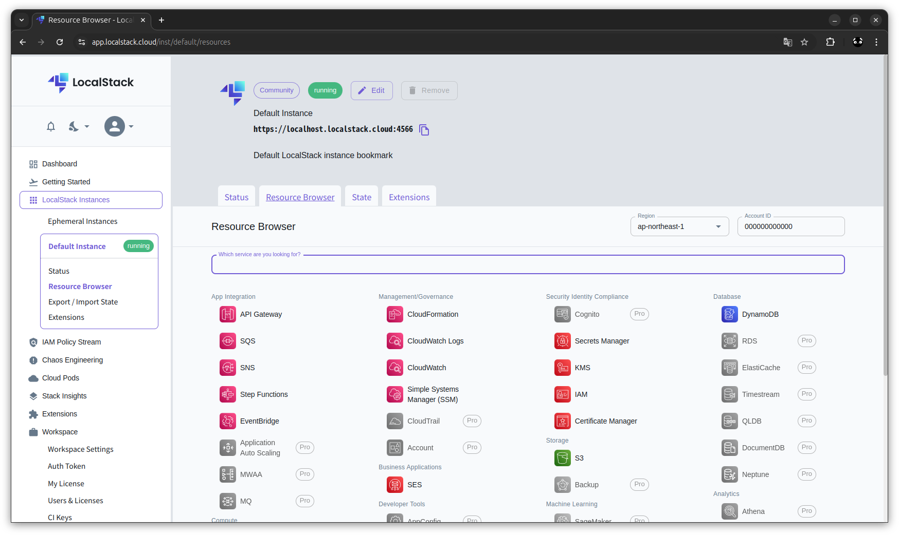
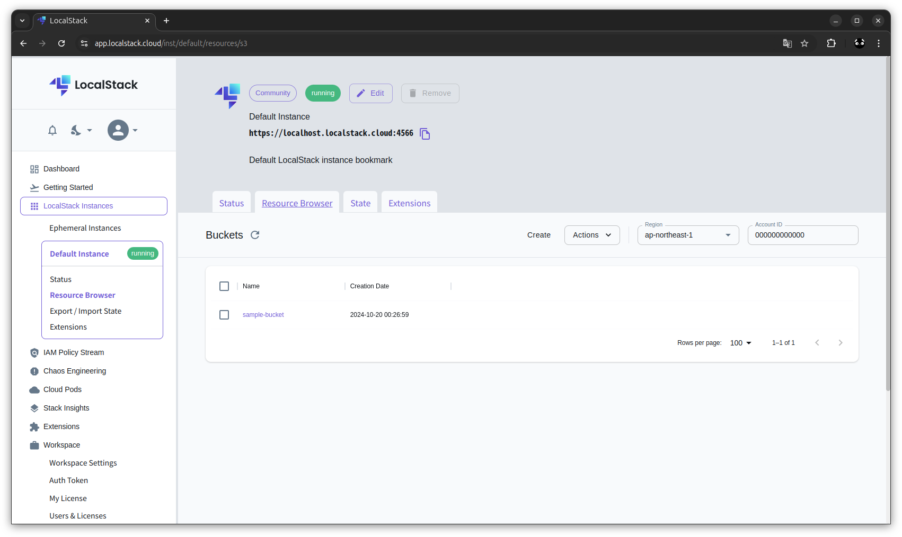
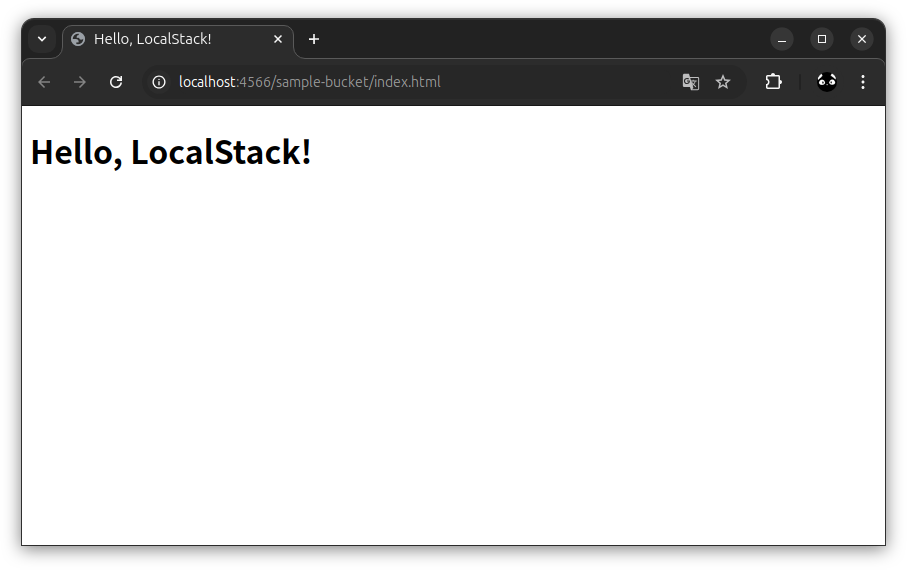
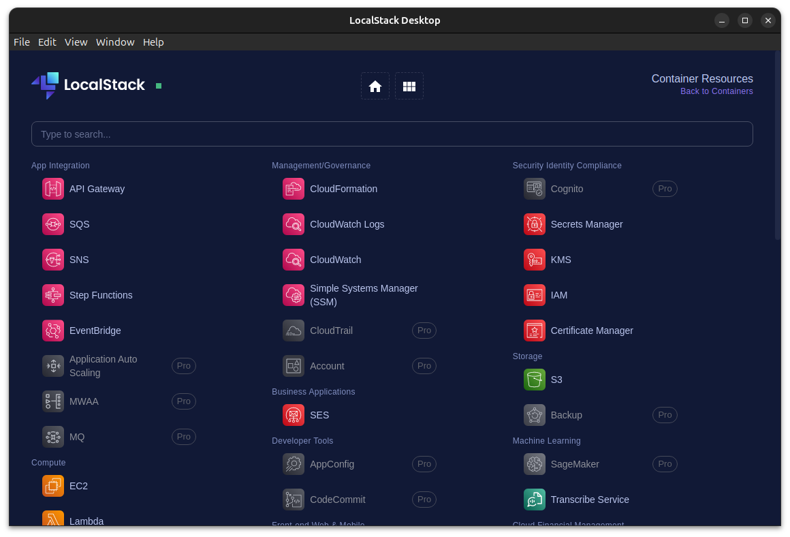

# aws_localstack_docker_example1

## 概要
* AWS エミュレータの LocalStack を Docker Compose で構築する
* aws-cli を使って構築した LocalStack 上に S3 バケットを作成する

LocalStack  
https://www.localstack.cloud/  
AWS のクラウドサービスをローカルマシーンでエミュレートできるサービス  

LocalStack - docs - Starting LocalStack with Docker-Compose  
https://docs.localstack.cloud/getting-started/installation/#docker-compose  

dockerhub - localstack/localstack  
https://hub.docker.com/r/localstack/localstack  

## 留意事項
* LocalStack は無料のコミュニティ版と有料のプロ版があり、有料のプロ版でないと使えない機能が多数ある
* 本リポジトリでは、無料のコミュニティ版を使用している
* LocalStack はテスト等の利便性を優先し、デフォルトで IAM ポリシーが無効になっている（設定しても無視される）
* IAM ポリシーを有効にする機能は、有料のプロ版でないと使用できない（ENFORCE_IAM とか）
* 特に AWS の勉強として使用する場合は、上記の点に留意するか、大人しくプロ版を買うこと

## 環境
* Ubuntu 24.04
* Docker version 27.3.1, build ce12230
* aws-cli/2.18.6 Python/3.12.6 Linux/6.8.0-45-generic exe/x86_64.ubuntu.24

## 準備

### AWS CLIの最新バージョンのインストールまたは更新  
https://docs.aws.amazon.com/ja_jp/cli/latest/userguide/getting-started-install.html  

Command line installer - Linux x86 (64-bit)
```
curl "https://awscli.amazonaws.com/awscli-exe-linux-x86_64.zip" -o "awscliv2.zip"
unzip awscliv2.zip
sudo ./aws/install
```

```
$ aws --version
aws-cli/2.18.6 Python/3.12.6 Linux/6.8.0-45-generic exe/x86_64.ubuntu.24
```

### プロファイル作成
※ダミーの設定で OK
```
$ aws configure --profile localstack
AWS Access Key ID [None]: dummy
AWS Secret Access Key [None]: dummy
Default region name [None]: ap-northeast-1                
Default output format [None]: json
```

### LocalStack サーバー起動

```
$ docker compose up
[+] Running 26/1
 ✔ localstack Pulled                                                                                                                                                                                             14.9s 
[+] Running 3/3
 ✔ Network aws_localstack_docker_example1_default             Created                                                                                                                                             0.1s 
 ✔ Volume "aws_localstack_docker_example1_localstack-volume"  Created                                                                                                                                             0.0s 
 ✔ Container localstack-main                                  Created                                                                                                                                             0.8s 
Attaching to localstack-main
localstack-main  | 
localstack-main  | LocalStack version: 3.8.1
localstack-main  | LocalStack build date: 2024-10-08
localstack-main  | LocalStack build git hash: 529aba7d8
localstack-main  | 
localstack-main  | Ready.
```

### LocalStack を GUI で操作・確認
※要 LocalStack アカウント  
※aws-cli を使用した CUI の操作については後述  
※LAN 内の別の端末で起動した LocalStack を操作する場合は、ブラウザ版ではなくデスクトップ版を使用する

* LocalStack のサイトに Sign in すると Dashboard が表示される
* 左側のメニューの LocalStack Instances の Default Instance から localhost:4566 で接続可能な LocalStack に対して状態の確認や操作が可能  
  * ~~localhost:4566 以外に接続したい場合は、 LocalStack Instances をクリックすると表示される LocalStack Instance Management から Add Bookmark で追加する~~
  * LAN 内の別の端末で起動した LocalStack に接続したい場合は、LocalStack Desktop を使用する（恐らくブラウザ版だとセキュリティ的に無理）
* 下図は Resource Browser で S3 バケットを表示した際のキャプチャ  
  * 右上の Region の指定を S3 バケットを作成したリージョンにすることを忘れずに！(2枚目の画像)  
  * 最新の状態が表示されない場合は、Buckets の横の更新ボタンを押す(2枚目の画像)
* 画面にある Create ボタンから GUI でリソースの作成が可能(2枚目の画像)
  * その隣の Actions にはリソースの削除などがある(2枚目の画像)





## S3 バケット

LocalStack - docs - Simple Storage Service (S3)  
https://docs.localstack.cloud/user-guide/aws/s3/  

### S3 バケット作成
```
$ aws s3 mb s3://sample-bucket --endpoint-url=http://localhost:4566 --profile localstack
make_bucket: sample-bucket
```

### S3 バケット一覧取得
```
$ aws s3 ls --endpoint-url=http://localhost:4566 --profile localstack
2024-10-20 00:19:53 sample-bucket
```

### S3 バケットにファイルをアップロード
```
$ aws s3 cp ./index.html s3://sample-bucket/ --endpoint-url=http://localhost:4566 --profile localstack
upload: ./index.html to s3://sample-bucket/index.html      
```

http://localhost:4566/sample-bucket/index.html  



※デフォルトで外部からの接続が許可されてる？（要確認）  
　→ LocalStack はデフォルトで IAM ポリシーが無視される。詳細は [留意事項](#留意事項) を参照　

### S3 バケット内のオブジェクト一覧取得
```
$ aws s3 ls s3://sample-bucket/ --endpoint-url=http://localhost:4566 --profile localstack
2024-10-20 01:36:10        245 index.html
```

### S3 バケット内のオブジェクト削除
```
$ aws s3 rm s3://sample-bucket/index.html --endpoint-url=http://localhost:4566 --profile localstack
delete: s3://sample-bucket/index.html
```

### S3 バケットの削除
```
$ aws s3 rb s3://sample-bucket/ --force --endpoint-url=http://localhost:4566 --profile localstack
remove_bucket: sample-bucket
```
※`--force` バケット内にオブジェクトが残っていても強制的に削除（残っていたオブジェクトは自動削除）

## メモ

### Ubuntu 24.04 で LocalStack Desktop を起動する方法

普通に起動しようとしても内部でエラー吐いて起動せず  
たぶん Electron 製   

* LocalStack にサインイン
* 左側のメニューの下の方に LocalStack Desktop があるのでクリック
* Linux をクリックして LocalStack-Desktop-community-1.0.7.AppImage をダウンロード  
  ※バージョンは読み替えて
* 端末から以下を実行  
  ```
  sudo apt install libfuse2
  chmod +x ./LocalStack-Desktop-community-1.0.7.AppImage 
  ./LocalStack-Desktop-community-1.0.7.AppImage --no-sandbox --disable-gpu
  ``` 



#### エラー記録
```
$ ./LocalStack-Desktop-community-1.0.7.AppImage 
dlopen(): error loading libfuse.so.2

AppImages require FUSE to run. 
You might still be able to extract the contents of this AppImage 
if you run it with the --appimage-extract option. 
See https://github.com/AppImage/AppImageKit/wiki/FUSE 
for more information
```
libfuse2 をインストールして再度実行
```
$ ./LocalStack-Desktop-community-1.0.7.AppImage 
[132373:1020/093714.717848:FATAL:setuid_sandbox_host.cc(158)] The SUID sandbox helper binary was found, but is not configured correctly. Rather than run without sandboxing I'm aborting now. You need to make sure that /tmp/.mount_LocalSSrtTmp/chrome-sandbox is owned by root and has mode 4755.
Trace/breakpoint trap (コアダンプ)
```
`--no-sandbox` 付けて再度実行
```
$ ./LocalStack-Desktop-community-1.0.7.AppImage --no-sandbox
(node:133750) NOTE: The AWS SDK for JavaScript (v2) will enter maintenance mode
on September 8, 2024 and reach end-of-support on September 8, 2025.

Please migrate your code to use AWS SDK for JavaScript (v3).
For more information, check blog post at https://a.co/cUPnyil
(Use `localstackdesktop --trace-warnings ...` to show where the warning was created)
[133967:1020/093938.035200:ERROR:sandbox_linux.cc(376)] InitializeSandbox() called with multiple threads in process gpu-process.
Checking for update
Generated new staging user ID: 9b445c97-0045-5b45-83bf-d78243a58194
バスエラー (コアダンプ)
```
`--disable-gpu` 付けて再度実行　→　起動できた
